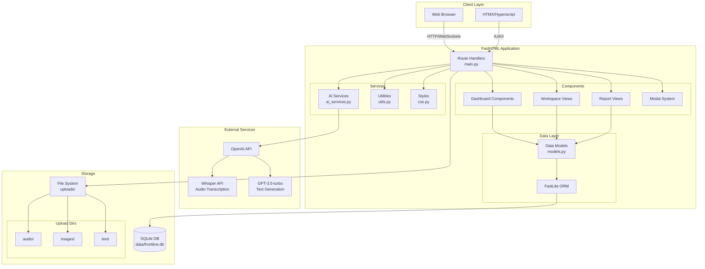
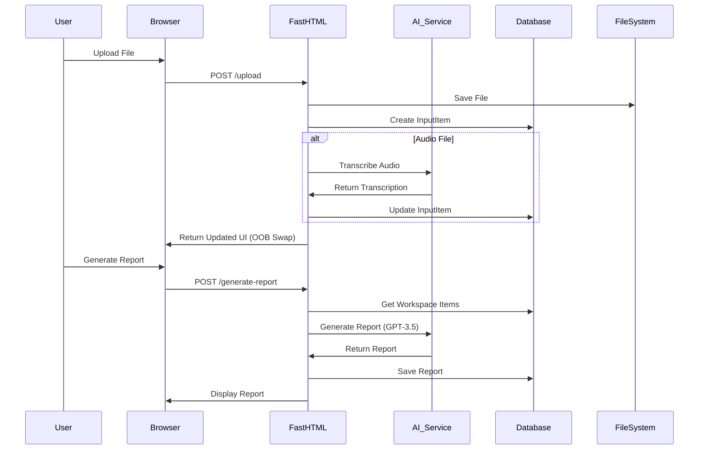
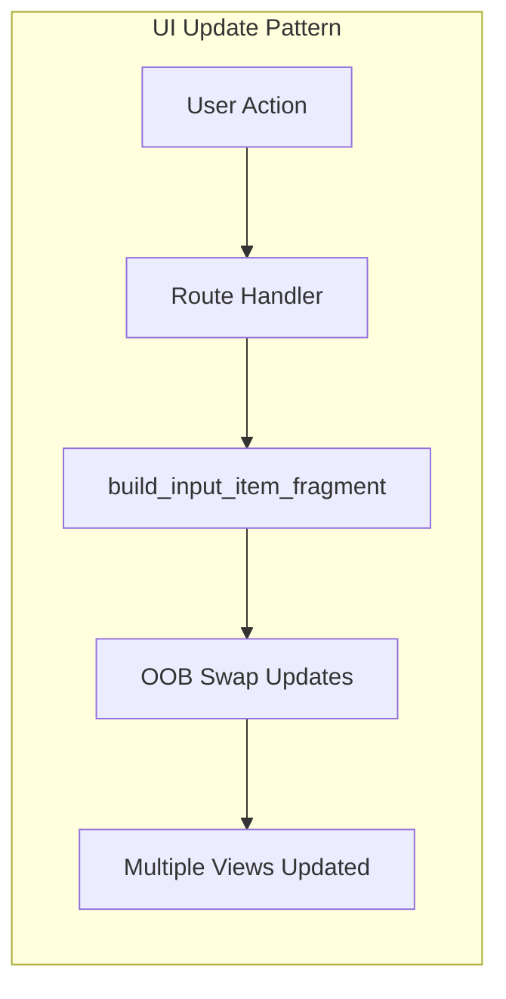
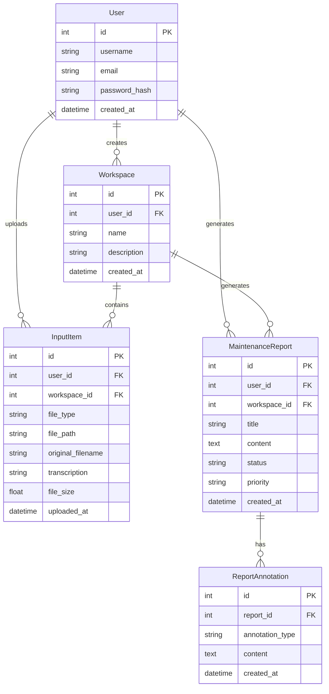

# FastHTML Maintenance Report Application - Architecture Diagram

## System Architecture

## Data Flow Diagram

## Component Interaction Pattern

## Database Schema

## Key Architectural Patterns

1. **Unified Fragment Pattern**: Single source of truth for UI components
2. **Out-of-Band (OOB) Updates**: Real-time updates across multiple views
3. **Modal System**: Centralized modal container with backdrop functionality
4. **Debounced Updates**: 500ms delay for auto-save operations
5. **Window Object State**: Global state management for audio recording